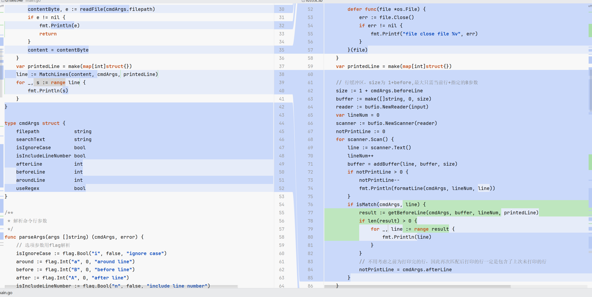
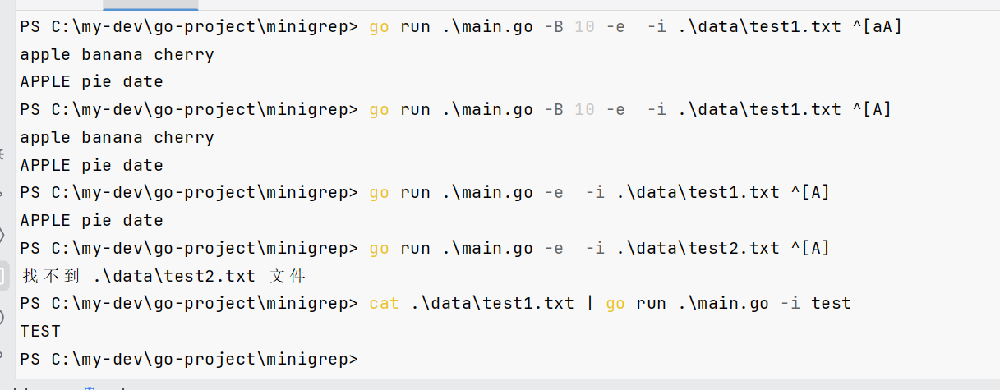

+++
author = "FarSightLi"
title = "五天速通go--搭建mini-grep(三)"
date = "2025-06-15"
description = "通过模仿grep工具来快速入门go语言"
categories = [
    "Go","项目实战"
]
tags = [
   "Go","项目实战"
]
+++

## 前言

笔者有两年Java开发经验，目前需要临时用go语言开发一些功能，为了快速入手Go语言，在简单了解基础语法后，决定以实战来巩固知识。

参考了《Rust圣经》的思路，决定先开发一个模仿grep的工具，来快速巩固基础语法、Go项目管理。

为精简内容，本系列不包含环境搭建等基础部分（网上教程写的更清楚详细），直接讲解开发思路。希望能对后来者提供一些入门思路。

笔者整体思路：大致了解go语言的语法，了解某个工具的大致功能、实现方法。然后再辅以AI语法提示（仅仅告诉某个细节，比如如何读取参数等，而不是直接让ai实现功能）。这样便能快速入门一个不算复杂的语言。

PS：代码仓库: https://github.com/FarSightLi/minigrep

## 正文

### 流式读取初步实现

我们首先修改之前读取输入流和文件的方法：

```go
var input io.Reader
    // 从输入流中读取
    filepath := cmdArgs.filepath
    if filepath == "" {
        input = os.Stdin
    } else {
        file, e := os.Open(filepath)
        if e != nil {
            if os.IsNotExist(err) {
                fmt.Printf("找不到 %s 文件", filepath)
            }
            if os.IsPermission(err) {
                fmt.Printf("权限被拒绝")
            }
            input = file
        }
        // defer 延迟关闭
        defer func(file *os.File) {
            err := file.Close()
            if err != nil {
                fmt.Printf("file close file %v", err)
            }
        }(file)
```

ps：为什么file可以直接赋值给input？虽然看起来file是 *File，而input是io.Reader

因为File实现了Reader的Read函数，这是一种隐式实现。

我们之前MatchLines的函数接受的是整个目标内容（string），为了减少代码修改，且尽可能复用测试方法，我们不应修改MatchLines方法的签名

所以我们可以在main函数中将input的内容读出来，再传进MatchLines

```go
    scanner := bufio.NewScanner(input)
    for scanner.Scan() {
        text := scanner.Text()
        lineNum++
        line := MatchLines(text, cmdArgs, printedLine)
        for _, s := range line {
            fmt.Println(s)
        }
    }
```

这样我们就无需修改核心代码，而测试方法中，我们也只需要将原来的content转为input，再手动处理scan即可。且鉴于现在的MatchLines匹配到的结果也是类似于流式的而非一次性的，我们可以将返回结果存起来（测试方法的数据不大，因此可以这样操作放至内存中）

```go
reader := strings.NewReader(tt.content)
            scanner := bufio.NewScanner(reader)
            var results []string
            for scanner.Scan() {
                text := scanner.Text()
                results = append(results, MatchLines(text, tt.cmdArgs, make(map[int]struct{}))...)
            }
```

### 小重构，全面适配流式处理

结果发现测试不通过😥，原因是此处追溯上下文的逻辑并不适配流式处理，需要改进。

原代码的逻辑大致分为几个模块:1.读取、解析参数 -> 2.加载整个内容到内存中 -> 3.匹配、格式化输出（强耦合了） -> 4.输出

正是因为3步强耦合了，所以之前的代码不再适用了。

由于我们是流式读取，所以我们在读取匹配行后，想要获取前X行就不再那么方便了。所以我们需要去维护一个缓冲区，长度至少为1（当前行）+Before行数，这样就可以快速从缓冲区中拿到所需要的行。而在匹配到目标行以后，打印After行也就简单了，只需记录还有多少后续未打印，在遍历每一行时打印即可。

根据以上思路，我们可以对原来的核心代码进行改造。



此外，之前代码关于根据a参数构建A、B参数的逻辑不应放在打印时，而应放在解析参数时。

### 报错提示优化:

至此我们的小玩具minigrep已经基本完成了。现在还有一个问题我们的错误输出也是写往标准输出流，这就会造成混乱及误解。我们需要将错误输出和匹配后的打印区分开来。在go中，这是很方便的。只需要将原来的fmt.Printf 函数换成fmt.Fprintf即可

### TODO 自动化测试

由于已经改了函数实现，所以之前的单元测试已经不适用了，而目前的实现也比较难以用gotest测试，后续有空可以写shell脚本来实现



改造后的全代码如下：

```go
package main

import (
    "bufio"
    "errors"
    "flag"
    "fmt"
    "io"
    "os"
    "regexp"
    "strings"
)

type cmdArgs struct {
    filepath            string
    searchText          string
    isIgnoreCase        bool
    isIncludeLineNumber bool
    afterLine           int
    beforeLine          int
    aroundLine          int
    useRegex            bool
    compile             *regexp.Regexp
}

func main() {
    args := os.Args
    cmdArgs, err := parseArgs(args)
    if err != nil {
        fmt.Println(err)
        return
    }
    var input io.Reader
    // 从输入流中读取
    filepath := cmdArgs.filepath
    if filepath == "" {
        input = os.Stdin
    } else {
        file, e := os.Open(filepath)
        if e != nil {
            if os.IsNotExist(e) {
                _, _ = fmt.Fprintf(os.Stderr, "找不到 %s 文件\n", filepath)
            } else if os.IsPermission(e) {
                _, _ = fmt.Fprintf(os.Stderr, "权限被拒绝\n")
            } else {
                _, _ = fmt.Fprintf(os.Stderr, "文件打开失败: %v", e)
            }
            return
        }
        input = file
        // defer 延迟关闭
        defer func(file *os.File) {
            _ = file.Close()
        }(file)
    }
    var printedLine = make(map[int]struct{})

    // 行缓冲区，size为 1+before,最大只需当前行+指定的B参数
    size := 1 + cmdArgs.beforeLine
    buffer := make([]string, 0, size)
    reader := bufio.NewReader(input)
    var lineNum = 0
    scanner := bufio.NewScanner(reader)
    notPrintLine := 0
    for scanner.Scan() {
        line := scanner.Text()
        lineNum++
        buffer = addBuffer(line, buffer, size)
        if notPrintLine > 0 {
            notPrintLine--
            fmt.Println(formatLine(cmdArgs, lineNum, line))
        }
        if isMatch(cmdArgs, line) {
            result := getBeforeLine(cmdArgs, buffer, lineNum, printedLine)
            if len(result) > 0 {
                for _, line := range result {
                    fmt.Println(line)
                }
            }
            // 不用考虑之前为打印完的行，因此再次匹配后打印的行一定是包含了上次未打印的行
            notPrintLine = cmdArgs.afterLine
        }
    }
    if err := scanner.Err(); err != nil {
        _, _ = fmt.Fprintf(os.Stderr, "扫描错误: %v\n", err)
    }
}

/**
 * 解析命令行参数
 */
func parseArgs(args []string) (cmdArgs, error) {
    // 选项参数用flag解析
    isIgnoreCase := flag.Bool("i", false, "ignore case")
    around := flag.Int("a", 0, "around line")
    before := flag.Int("B", 0, "before line")
    after := flag.Int("A", 0, "after line")
    isIncludeLineNumber := flag.Bool("n", false, "include line number")
    useRegex := flag.Bool("e", false, "use regex module")
    err := flag.CommandLine.Parse(args[1:])
    if err != nil {
        return cmdArgs{}, err
    }

    // 非选项参数用普通方式解析
    nonFlagArgs := flag.Args()
    // 只包含了搜索内容
    var searchText string
    var filepath string
    if len(nonFlagArgs) == 1 {
        filepath = ""
        searchText = nonFlagArgs[0]
    } else if len(nonFlagArgs) == 2 {
        filepath = nonFlagArgs[0]
        searchText = nonFlagArgs[1]
    } else {
        return cmdArgs{}, errors.New("参数错误,标准参数只允许有文件路径和搜索内容")
    }
    if *around > 0 {
        after = around
        before = around
    }

    // 提前编译正则
    var compile *regexp.Regexp
    if *useRegex {
        c, err := regexp.Compile(searchText)
        if err != nil {
            return cmdArgs{}, fmt.Errorf("非法的正则表达式: %v\n", err)
        }
        compile = c
    }
    return cmdArgs{filepath,
        searchText,
        *isIgnoreCase,
        *isIncludeLineNumber,
        *after,
        *before,
        *around,
        *useRegex,
        compile}, nil
}

/**
 * 搜索文件并打印内容
 */
func isMatch(cmdArgs cmdArgs, line string) bool {
    // 使用正则模式
    if cmdArgs.useRegex {
        return cmdArgs.compile.MatchString(line)
    } else {
        searchText := cmdArgs.searchText
        if cmdArgs.isIgnoreCase {
            searchText = strings.ToLower(searchText)
            line = strings.ToLower(line)
        }
        return strings.Contains(line, searchText)
    }
}

func addBuffer(line string, buffer []string, size int) []string {
    if len(buffer) > size {
        buffer = buffer[1:]
    }
    return append(buffer, line)
}

/**
 * 获得匹配行之前的所有行（已格式化）
 * 其实这里可以直接打印匹配的行，可以节约一定内存
 */
func getBeforeLine(cmdArgs cmdArgs, buffedLine []string, currentLineNum int, printedLine map[int]struct{}) (result []string) {
    // 用于计算、定位的下标以buffer位置
    length := len(buffedLine)
    start := length - cmdArgs.beforeLine - 1
    if start < 0 {
        // 即从头打印
        start = 0
    }
    result = make([]string, 0)
    for index := start; index <= length-1; index++ {
        // index对应的当前真实行号 = 当前行号 - 偏移量（length-1-index）
        lineNum := currentLineNum - (length - 1 - index)
        // 如果打印过了就不再打印
        if _, exist := printedLine[lineNum]; exist {
            continue
        }
        result = append(result, formatLine(cmdArgs, lineNum, buffedLine[index]))
        printedLine[lineNum] = struct{}{}
    }
    return result
}

func formatLine(args cmdArgs, index int, line string) string {
    if args.isIncludeLineNumber {
        return fmt.Sprintf("%d:%s", index, line)
    } else {
        return line
    }
}
```

## 总结

至此，我们已经完成了mini-grep，再此次优化中，我们加深了string切片、map模拟set的方法，更重要的是我们掌握了流式读取的核心用法
